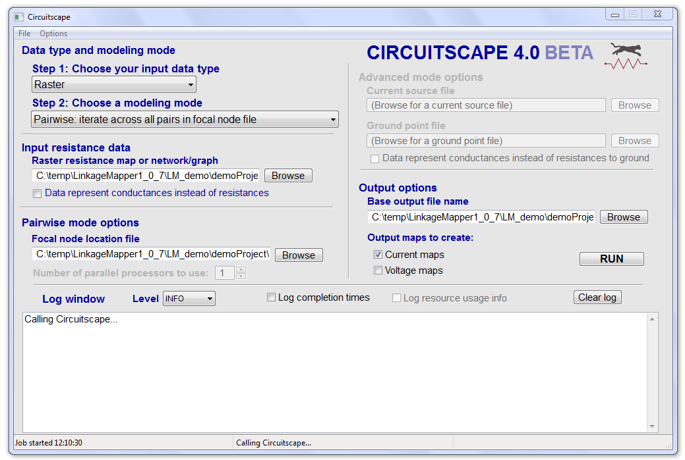
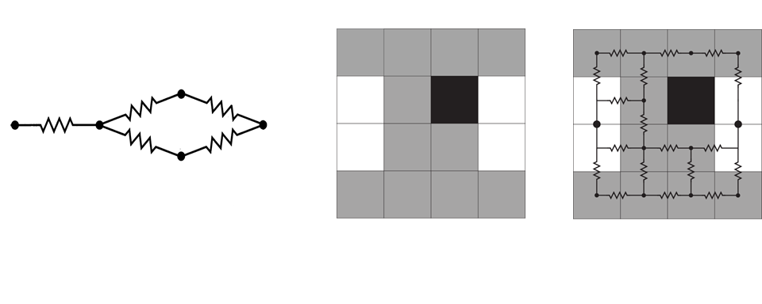
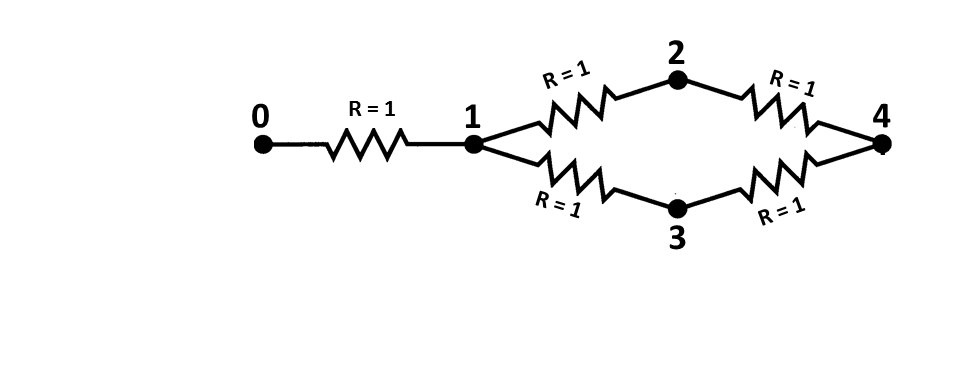
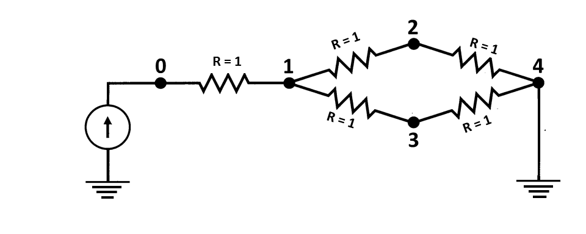
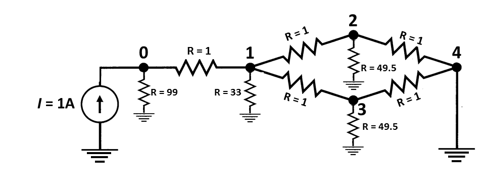
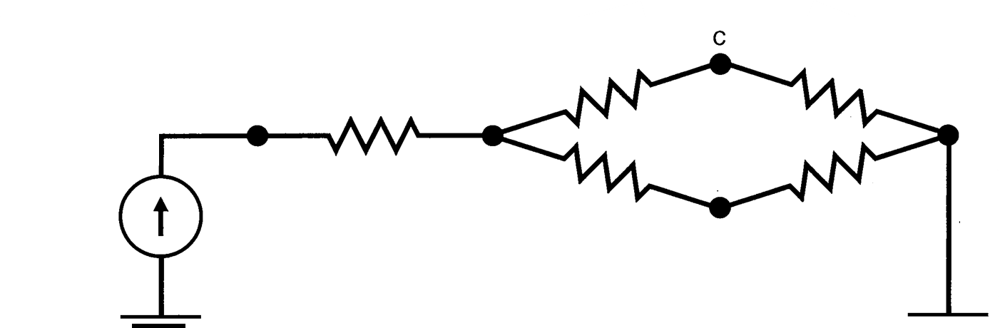
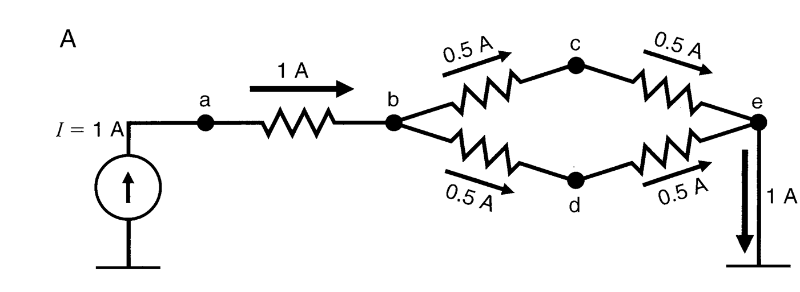

#CIRCUITSCAPE User Guide 

**Brad McRae, Viral Shah, and Tanmay Mohapatra**

**Version 4.0 Beta - Updated December 24, 2013**

***How to cite this document:***
<br/>McRae, B.H., V.B. Shah, and  T.K. Mohapatra. 2013\.  Circuitscape User 
Guide.  ONLINE. The Nature Conservancy. Available at: 
http://www.circuitscape.org.

**First time users:** Please see the section on memory management before 
running large grids (> 1 million cells).


#1. Introduction


Circuitscape is an open-source program that uses circuit theory to predict 
connectivity in heterogeneous landscapes for individual movement, gene flow,
and conservation planning. Circuit theory complements commonly used
connectivity models because of its connections to random walk theory and
its ability to simultaneously evaluate contributions of multiple dispersal 
pathways. Landscapes are represented as conductive surfaces, with low 
resistances assigned to landscape features types that are most permeable to 
movement or best promote gene flow, and high resistances assigned to movement
barriers.  Effective resistances, current densities, and voltages calculated
across the landscapes can then be related to ecological processes, such as
individual movement and gene flow.  More detail about the model, its
parameterization, and potential applications in ecology, evolution, and
conservation planning can be found in McRae (2006) and McRae et al. (2008).

Circuitscape was originally designed to analyze connectivity across raster 
grids. With version 4.0, Circuitscape can now analyze arbitrary networks (i.e., 
graphs with any set of connections between nodes the user specifies).


Circuitscape can be run from a stand-alone interface or from an ArcGIS toolbox:



**Fig. X.** Stand-alone interface (supports raster and network analyses).


**Fig. X.** ArcGIS Toolbox (for raster-based analyses only). The toolbox also 
includes utilities to put raster and feature class inputs into a common 
coordinate system. More utilities for creating core habitat areas and 
resistance layers are in development.


###Before You Start


Whatever software you use, connectivity modeling involves a great deal of
research, data compilation, GIS analyses, and careful interpretation of
results. Defining areas to connect, parameterizing resistance models, and
other modeling decisions you will need to make are not trivial. Before diving
in, we strongly recommend that users first acquaint themselves with the
process and challenges of connectivity modeling by consulting published
resources. Good places to start include overviews on the 
[Corridor Design](http://www.corridordesign.org/) and 
[Connecting Landscapes](http://connectinglandscapes.org/) websites. Spear et 
al. (2010), Beier et al. (2011) and Zeller et al. (2012) also offer helpful 
advice on resistance mapping and connectivity analysis in general. 

Lastly, users interested in mapping important connectivity areas may wish to 
consider [Linkage Mapper](https://code.google.com/p/linkage-mapper/), which 
maps least-cost corridors. Linkage Mapper now also hybridizes least-cost 
corridor modeling with Circuitscape (see the Pinchpoint Mapper tool within the 
Linkage Mapper toolkit). Links to other connectivity tools can be found on the 
[Corridor Design](http://www.corridordesign.org/) and [Connecting 
Landscapes](http://connectinglandscapes.org/) websites. 

#2. How Circuitscape Works 

Circuitscape may be called through its own graphical user interface, from the 
Circuitscape for ArcGIS Toolbox, or from the command line. Users supply 
Circuitscape with resistance data and the program calculates resistances 
across landscapes and/or creates maps of current flow and voltages across 
landscapes and networks. 

### Two data types: network and raster 

 


???add in raster without resistors in middle??

**Fig. x.** Simple illustrations of network and raster data types used by 
Circuitscape. The program can operate on networks of nodes (left panel) or 
raster grids (right panel; from McRae et al. 2008). For rasters, adjacent 
cells are connected to their four or eight neighbors by resistors. 

Circuitscape reads either a network of nodes connected by links (above, left) 
or a raster map of resistances (above, right). Links and raster cells 
facilitate or impede movement to different degrees. Networks and raster maps 
can be coded in resistances (with higher values denoting greater resistance to 
movement) or concordances (the reciprocal of resistance; higher values indicate 
greater ease of movement). 


For rasters, every grid cell with finite resistance is represented as a node 
in a graph, connected to either its four first-order or eight second-order 
neighboring habitat cells. Cells with infinite resistance (zero conductance) 
are dropped. Habitat patches, or collections of cells, can be assigned zero 
resistance (infinite conductance) using a separate "short-circuit region" 
file. These collections of cells are collapsed into a single node. 

### Calculation modes 

Circuitscape operates in one of four modes: **pairwise**, **advanced**, 
**one-to-all**, and **all-to-one**. Pairwise and advanced modes are available 
for both raster and network data types. The one-to-all and all-to-one modes 
are available for raster data only. 

In the pairwise mode, connectivity is calculated between all pairs of focal 
nodes (points or regions between which connectivity is to be modeled) supplied 
to the program in a single input file. For each pair of focal nodes, one node 
will arbitrarily be connected to a 1-amp current source, while the other will 
be connected to ground. Effective resistances will be calculated iteratively 
between all pairs of focal nodes, and, if selected, maps of current and 
voltage will be produced. If there are *n* focal nodes, there will be *n*(*n* 
\- 1)/2 calculations **unless** you're using focal points and not mapping 
currents or voltages. In the latter case, we can do it in *n* calculations 
**(much faster)**. 

The advanced mode offers much greater flexibility in defining sources and 
targets for current flow. The user defines any number of current sources and 
any number of grounds in a network or raster landscape, and these are all 
activated simultaneously. Sources represent points or areas from which current 
flows, whereas grounds represent areas where current exits out of the system. 

Source nodes can have different strengths (i.e. inject more or less current 
into the network or landscape), and ground nodes can be tied to ground with 
any resistance. Current sources and grounds are supplied in separate input 
files. Outputs include maps of current density flowing through each node or 
raster cell, and voltages at each node or raster cell. 

Two other modes are available for raster data types. The one-to-all mode is 
similar to the pairwise mode, and takes the same input files. However, instead 
of iterating across all focal node *pairs*, this mode iterates across all 
focal nodes. In each iteration, one focal node is connected to a 1-amp current 
source, while all remaining focal nodes are connected to ground. If there are 
*n* focal nodes, there will be *n* calculations. 

The all-to-one mode is similar to the one-to-all mode, and takes the same 
input files. However, in this mode Circuitscape connects one focal node to 
ground and all remaining focal nodes to 1-amp current sources. It then repeats 
the process for each focal node; if there are *n* focal nodes, there will be 
*n* calculations. 

Circuitscape generates maps showing the current density and voltage at each 
node or cell under each configuration (and current flow for each link in 
networks). Additionally, Circuitscape writes an output file reporting 
effective resistances between all pairs of focal nodes in the pairwise mode, 
and between each node and ground in the one-to-all mode. Resistances in the 
all-to-one mode are undefined, so a results file is written with zeros 
indicating successful solves. 

### Illustrations of analyses with network data 

For network data types, any node can be connected to any other node by a 
resistor: 

 

**Fig. X.** Example network for analysis. This network can be input as a 
**text list** specifying nodes 0-4 and resistances resistances between each 
pair of connected nodes (see the "Input file formats" section below). 

For **pairwise analysis** we would also supply a list of focal nodes 
(containing at least two node numbers, but as many as five, the number of 
nodes in the circuit) between which we want to perform calculations. 

 

 

**Fig X.** In pairwise mode, Circuitscape will iterate across pairs of nodes 
in a focal node list. If node 0 and node 4 are in the focal node list, then 
one of the iterations will look like the above, with a 1 amp current source 
connected to one node and the other grounded. Current will flow across the 
network from the source to the ground (bottom pane). Branch currents, node 
currents, node voltages, and effective resistances between node pairs can be 
calculated for each iteration. 

More complexity can be added by running in **advanced mode**. For example, we 
could modify the circuit above by adding a single, fixed source at node zero 
and adding multiple grounds with different resistances: 
 

 

**Fig. X.** In advanced mode, any node can be tied to a current source or to 
ground (either directly or via resistors with any value). Currents passing 
through all nodes and links can then be calculated (lower pane), and voltages 
can be calculated at each node. 

### Illustrations of analyses with raster data 

 

**Fig. 1.** Example raster input files for **pairwise and one-to-all modes**. 
Input files in this example include a **habitat map** specifying per-cell 
resistances or conductances, a **focal node location file** (with two focal 
regions and one focal point in this case), and an optional **short-circuit 
region map**. Focal regions and short-circuit regions represent areas with 
zero resistance. Cells with the same region ID are considered perfectly 
connected and are collapsed into a single node, even if they are not 
contiguous. 

 **Fig. 2.** Schematic describing 
**pairwise** mode analyses that would result from the input files shown in 
Fig. 1. Three sets of pairwise calculations-- involving focal nodes 1 and 2, 
nodes 1 and 3, and nodes 2 and 3--would be conducted. For each pair, one node 
would be connected to a 1-amp current source, and the other to ground. Note 
that focal region nodes become short- circuit regions when they are activated 
(e.g., node 1 in scenario 1), but these regions are not present when the nodes 
are not activated (e.g., node 1 in scenario 3). 

 

**Fig. 3.** Schematic describing **one-to-all mode** analyses that would 
result from the input files shown in Fig. 1. Three sets of calculations-- 
involving focal nodes 1, 2, and 3--would be conducted. For each, one node 
would be connected to a 1-amp current source, and the other two would be 
connected to ground. The all-to-one mode is similar, with arrow directions 
reversed; that is, one node is connected to ground while the remaining nodes 
are connected to 1-amp current sources. 

 

**Fig. 4.** Example raster input files for **advanced mode**, which requires 
independent **current source and ground files**. Note that current sources in 
this example have different "strengths," and ground nodes are connected to 
ground with differing levels of resistance. This example also includes an 
optional grid of five short-circuit regions. 

 

**Fig. 5.** The first two panels show the "effective" configuration resulting 
from the input files in Fig. 4. Because current source C and grounds D and E 
overlap with short-circuit regions, these short-circuit regions effectively 
become sources or grounds themselves. The rightmost panel shows a schematic of 
the resulting analysis, with all sources (white points and polygons) and 
grounds (black points and polygons) activated simultaneously. Note that 
sources may be negative (drawing current out of the system), and ground nodes 
can actually contribute current to the system when negative sources are 
present. 

#3. Installing Circuitscape 

## Windows and Mac OS X executables (most users) 

Download and run the appropriate setup package. This will install Circuitscape 
and create an "examples" directory in the installation directory with example 
input files on Windows. Mac users should download this directory separately. 

## ArcGIS Toolbox (Windows only) 

If you have ArcGIS 10.0 or later, you can download and install the 
Circuitscape for ArcGIS Toolbox from the Circuitscape website. Follow the 
installation instructions included in the zip package. You will also need to 
install the Circuitscape executable package. 

## Installing Circuitscape as a Python Package 

For Python users, Circuitscape is available as a regular Python package from 
the Python packages repository. You will need to install several packages upon 
which Circuitscape depends. Run the following command to get Circuitscape: 

```` sudo pip install -U circuitscape ```` 

Python can be installed from http://www.python.org/ and the `pip` installer 
from http://www.pip-installer.org/en/latest/installing.html. 

Once installed, the following commands are available for using Circuitscape: 

- `python csgui.py` : To use the graphical user interface 
- `python csrun.py <path to .ini configuration 
- ` : To use Circuitscape from the console. 
- `python csverify.py` : To verify the installation. 

Other packages you will need include Python 2.7, Numpy, Scipy, PyAMG, wxPython 
2.8, and PythonCard. 

## Linux 

???Replace below??? Would pip work for this? 

Instructions to install and run Circuitscape on Linux can be found on the 
Circuitscape website. 

#4. Using Circuitscape with the graphical user interface 

To start the user interface using Windows, run Circuitscape as you would any 
other installed program. In Mac OS X, double-click on Circuitscape.app. The 
user interface shown above will appear. You can also call Circuitscape from 
the command line (DESCRIBE) or from the Circuitscape for ArcGIS Toolbox, 
available from the Circuitscape website. 

##Step 1: Choose your input data type 

The first step is to tell Circuitscape whether you want to analyze an 
arbitrary network or raster landscape data. 

##Step 2: Choose a modeling mode 

As described above, Circuitscape is run in one of four modes. Pairwise and 
advanced modes are available for both raster and network data types. The 
one-to-all and all-to-one modes are available for raster data only. 

_--------ROLL INTO FIGURES ABOVE??:_ 
In the pairwise mode, resistance, current 
and voltage are calculated iteratively between all pairs of focal nodes (Figs. 
1 and 2), the locations of which are supplied in a single file. In the 
one-to-all mode, resistance, current and voltage will be calculated between 
one focal node and ground, with all remaining focal nodes set to ground (Figs. 
1 and 3). Circuitscape will then repeat this for each focal node. In the 
all-to-one mode, one focal node will be connected to ground with all others 
connected to 1-amp current sources (Figs. 1 and 3), repeating this for each 
focal node. Under the advanced mode, any number of sources and grounds can be 
activated simultaneously (Figs. 4 and 5). Current sources and grounds are 
entered in separate files. 

##Raster resistance map or network/graph 

The resistance file specifies the ability of each cell in a landscape or link 
in a network to carry current. File formats are described in the 'Input file 
formats' section below. 

###Choose habitat data type: RESISTANCE or CONDUCTANCE 

Most users code their network or raster data in terms of resistances (with 
higher values denoting greater resistance to movement), which is common in 
connectivity modeling. However, checking this box allows you to specify 
conductances instead (conductance is the reciprocal of resistance; higher 
values indicate greater ease of movement). 

Note that zero and infinite values for conductances and resistances represent 
special cases. Infinite resistances are coded as NODATA values (see file 
format description in the Input File Format section below) in input resistance 
grids, or as zero or NODATA in input conductance grids; these are treated as 
complete barriers, and are disconnected from all other cells. For raster 
analyses, cells with zero resistance or infinite conductance can be specified 
using separate short- circuit region files as described below. 

## Pairwise, one-to-all, and all-to-one mode options 

###Focal node location and data type 

This file specifies locations of nodes between which effective resistance and 
current flow are to be calculated (See Figs. 1 and 2). Files may be text lists 
specifying coordinates or Arc/Info ASCII grids. When a grid is used, it must 
have the same cell size and extent as the resistance grid. The value stored in 
each grid cell location refers to the focal node ID (see ASCII grid format in 
the Input File Format section below); a single ID can occupy more than one 
cell in the grid if the "focal regions" option is selected (see below). Each 
focal node should have a unique positive integer ID. Cells that do not contain 
focal nodes should be coded with NODATA values. When a text list is used, the 
value field references the focal node ID (see Text list format in the Input 
File Format section below); a single ID can occupy more than one pair of 
coordinates (and more than one cell in the underlying habitat grid) if the 
"focal regions" option is selected. Examples are in the examples directory 
(located where Circuitscape is installed, e.g. C:\Program Files\Circuitscape) 
and can also be found on the Circuitscape downloads page. 

Focal nodes may occur at points (single cells on the habitat grid) or across 
regions. For the latter, at least one identifier must occur across multiple 
cells; these cells will then be collapsed into a single node, as they are when 
short-circuit region files are used (see below). The difference is that a 
focal region will be "burned in" to the habitat grid only for pairwise 
calculations that include that focal node. As with short-circuit regions, 
focal regions need not be made up of contiguous cells. For large grids or 
large numbers of focal nodes, focal regions may require more computation time. 
When calculating resistances on large raster grids and not creating resistance 
or current maps, focal points can run much more quickly. 

## Advanced mode options 

###Current source file 

This file specifies locations and strengths, in amps, of current sources 
(Figs. 4 and 5). Either a raster or a text list may be used. Rasters must have 
the same cell size, projection, and extent as the resistance grid, and cells 
that do not contain grounds should be coded with NODATA values. Cells that do 
not contain current sources should be coded with NODATA values. Note: current 
sources may be positive or negative (i.e., they may inject current into the 
grid or pull current out. Similarly, grounds may either serve as a sink for 
current or may contribute current if there are negative current sources in the 
grid). Examples are in the examples directory. 

###Ground point file 

This file specifies locations of ground nodes and resistances or conductances 
of resistors tying them to ground (Figs. 4 and 5). Either a raster or a text 
list may be used. Rasters must have the same cell size, projection, and extent 
as the resistance grid, and cells that do not contain grounds should be coded 
with NODATA values. Note that if a direct (R = 0) ground connection conflicts 
with a current source, the ground will be removed unless the 'remove source' 
option in the Options Window is chosen. Example ground input files are in the 
examples directory. 

###Data represent conductances instead of resistances to ground The default 
(unchecked) setting is to specify resistances to ground. Checking this box 
allows the user to specify connections to ground in terms of conductance 
instead. 

## Output options 

###Base output filename 

Prompts user to browse and choose a directory path and base file name for 
output files. Resistances, current maps, voltage maps, and user interface 
settings will all use this base name, along with appropriate suffixes and 
extensions. 

###Create current maps 

Generates current maps for every pair of focal nodes in the pairwise mode, or 
for the current source and ground configuration specified in the advanced 
mode. Current maps have the same dimension as the original input files, with 
values at each node (cell) representing the amount of current flowing through 
the node. In the pairwise mode, a current map file will be created for each 
focal node pair, and a cumulative (additive) file will be also written. 
Pairwise current maps will be identical regardless of which node is the source 
and which is the ground due to symmetry. For the advanced modeling mode, a 
single map will be written showing current densities at each cell resulting 
from the current source and ground configurations in the input files. These 
files can be imported into a GIS and displayed as in Fig. 6 (Log transforming 
values will be helpful and can be done automatically using the "Options" 
submenu. We used the color ramp in the Grid Tools extension for ArcView 3.x by 
Jeff Jenness for Fig. 6. Similar color ramps can be constructed in ArcMap and 
QGIS.) Such maps can be used to identify areas which contribute most to 
connectivity between interest points (McRae et al. 2008). 

###Create voltage maps 

For the pairwise modeling mode, voltage maps specify node voltages that would 
be observed for each focal node pair if one node were connected to a 1 amp 
current source and the other to ground. For the advanced modeling mode, 
voltage maps specify voltages at each cell resulting from the current source 
and ground configurations in the input files. 

 

Fig. 6. Current map used to predict important connective habitat between core 
habitat areas (green polygons, entered as focal regions) for mountain lions. 
Warmer colors indicate areas with higher current density. "Pinch points," or 
areas where connectivity is most tenuous, are shown in yellow. Research 
Collaborators: Brett Dickson and Rick Hopkins, Live Oak Associates. 

###The File menu 

####File >> Load settings from last run 

Loads settings automatically saved the last time the "Run" button was clicked. 

####File >> Load settings from file 

Allows user to browse for a configuration file (.ini extension) with 
previously saved settings. These can include settings automatically saved in 
the user-specified output directory upon clicking the "Run" button, or those 
saved manually using the "Save settings" function. 

####File >> Save settings 

Allows the user to save settings they have entered in the user interface for 
future retrieval as a configuration file (.ini extension). This option is 
useful for creating run configurations for use in batch mode. 

####File >> Verify code 

Allows the user to verify that their installation is working properly. 
Datasets in the "verify" directory will be used, and effective resistances and 
current maps will be checked against known correct values. If verification 
fails, see the terminal (Windows) or run the console utility (Mac) to see 
details. 

####File >> Run in batch mode 

Using the batch mode, you can specify any number of configurations to run by 
loading configuration files saved in a single directory. This can be useful 
for running large numbers of analyses. The configuration files can be created 
in the user interface and saved under "Save settings" as described above. 

###The Options window 

?? options window?? 

This window gives access to lesser-used options. To access this window via the 
menu bar, click on Options>> More settings & inputs. 

####Calculation Options>> Connect raster cells to FOUR neighbors instead of EIGHT 

For raster operations, Circuitscape creates a graph (network) by connecting 
cells to their four or eight immediate neighbors, as specified by the user. 
The default is eight, but check this box if you want to connect cells to four 
cardinal neighbors only. 

###Calculation Options>>Choose habitat data type: RESISTANCE or CONDUCTANCE 

This choice specifies whether habitat map files are coded in resistances (with 
higher values denoting greater resistance to movement) or conductances (the 
reciprocal of resistance; higher values indicate greater ease of movement). 

Zero and infinite values for conductances and resistances represent special 
cases. Infinite resistances are coded as NODATA values (see file format 
description in the Input File Format section below) in input resistance grids, 
or as zero or NODATA in input conductance grids; these are treated as complete 
barriers, and are disconnected from all other cells. Cells with zero 
resistance or infinite conductance can be specified using separate short- 
circuit region files as described below. 

####Calculation Options>> Use average conductance instead of resistance for connections between cells 

For raster operations, this choice determines whether cells are connected by 
their average resistance or by their average conductance. Most users will want 
the default (unchecked). 

The distinction is particularly important when connecting cells with zero or 
infinite values. When average resistances are used, first-order neighbors 
connected by resistors with resistance given by: _Rab_ = (_Ra_ \+ _Rb_) / 2, 
and second-order (diagonal) neighbors are connected by resistors with 
resistance given by: _Rab_ = √2 * (_Ra_ \+ _Rb_) / 2, where _Ra_ and _Rb_ are 
the resistances of the neighboring cells. When average conductances are used, 
first-order neighbors connected by resistors with conductance (the reciprocal 
of resistance) given by: _Gab_ = (_Ga_ \+ _Gb_) / 2, and second-order 
(diagonal) neighbors are connected by resistors with resistance given by: 
_Gab_ = (_Ga_ \+ _Gb_) / (2*√2), where _Ga_ and _Gb_ are the conductances of 
the neighboring cells. (As noted above, resistance and conductance are 
reciprocals of each other, i.e., _Gab_ = 1 / _Rab_.) 

####Calculation Options>> Pairwise mode: Run in low memory mode 

For raster operations, this option will use less memory in the pairwise mode 
when focal points are used, but will also run somewhat slower. 

####Calculation Options>> Advanced mode: use unit currents (i=1) for all 
current sources 

All current sources will be set to 1 amp, regardless of the value specified in 
the current source input file. 

####Calculation Options>> Advanced mode: use direct connections to ground (R=0) for all ground points 

All ground cells will be tied directly to ground, regardless of the value 
specified in the input ground file. 

####Calculation Options>> Advanced mode: when a source and ground are at the same node: 

Whenever a cell is connected both to a current source and to ground, this 
choice will determine whether the source is removed, the ground is removed, 
both are removed, or both are retained. For the latter, if a source is tied 
directly to ground (i.e., with zero resistance), the ground connection will be 
removed. 

####Mapping Options>> Compress output grids 

Output ASCII grids are automatically compressed using the gzip file format. 
This can be useful when many large maps will be written. 

####Mapping Options>> Log-transform current maps 

Values in output current maps will reflect a log10 transform of current 
densities, which is useful for visualizing them in a GIS. Cells with zero 
current will be recoded with NODATA values. 

####Mapping Options>> Write cumulative map only 

Maps of current flow between each pair of focal nodes (or for each focal node 
in one-to-all and all-to-one modes) will be calculated, but only one summed 
map of current from all calculations will be written to disk. 

####Optional Input Files>> Read raster mask file 

When checked, a dialog will open to select a raster mask file in ASCII grid 
format. Cells with negative, zero, or NODATA values in the mask will be 
dropped from the corresponding habitat map. Positive integer cells will be 
retained. File should only contain integers and have a .asc extension. See 
example file "mask.asc" in the examples directory. 

####Optional Input Files>> One-to-all and All-to-One modes: Read source strength file 

When checked, a dialog will open to select a text list of focal node IDs and 
corresponding source strengths. For any focal node in this list, the amount of 
current injected into that node when it is a source node will be set to the 
strength specified in the list. All nodes not in the list will defaul to 1 
Amp. This should be in the same file format as the Text List File Format given 
below, but with two columns (ID followed by source strength). File should have 
a .txt extension. See example file "source_strength_list.txt" in the examples 
directory. 

####Optional Input Files>> Load a raster short-circuit region map 

This file provides locations of short-circuit regions, stored in Arc/Info 
ASCII grid format. Short-circuit regions act as areas of zero resistance, 
essentially providing patches through which current is given a "free ride" as 
it flows across the landscape. Each short-circuit region should have a unique 
positive integer identifier; cells within each region are merged into a single 
node with all other cells in the region, including non-adjacent cells (i.e., 
regions need not be contiguous). Non-short-circuit-region areas should be 
stored as NODATA values. The file must have the same cell size and extent as 
the habitat grid. 

####Optional Input Files>> Read file with focal node pairs to include/exclude 

When checked, a dialog will open to select a ??------CHANGE-------- matrix 
identifying which pairs of focal nodes to connect. The file specifies minimum 
and maximum values in the matrix to consider a pair connected. This can be 
useful when used with a distance matrix to only run analyses between points 
separated by a minimum distance, or by a distance equal to or less than a 
maximum distance. Note: any focal node not in the matrix will be dropped from 
analyses. Entries on the diagonal are ignored. For example, in the following 
matrix, only pairs with entries between 2 and 50 are connected. Pairs (1,2), 
(2,4), and (3,4) will not be analyzed. Focal node 5 will be dropped entirely: 


```
min        2  
max        50  
0      1      2      3       4      5  
1      0      100    6.67    7      1  
2      100    0      11      1      60
3      6.67   11     0      -1      100  
4      7      1      -1      0      0
5      1      60     100     0      0
```

This affects all modes except the Advanced Mode.  Files should be in tab-
delimited text with a .txt extension. See example file
"matrix_of_pairs_to_include_and_exclude.txt" in the examples directory.

###The Log Window

####Level


####Log completion times 

Writes names of operations and completion times for each to the terminal screen.


#5\. Using the Circuitscape for ArcGIS Toolbox (Windows only)

The ArcGIS toolbox can facilitate raster Circuitscape analyses.  It allows you 
to run Circuitscape from ArcMap or ArcCatalog, using ESRI grids or raster file 
geodatabases as inputs (no need to export to ASCII). Toolbox options correspond 
to those in the stand-alone user interface described above. The toolbox also 
has utilities to convert shapefiles and feature classes to raster focal node 
files. You must have the Circuitscape executable installed to use the toolbox. 


#6\. Running Circuitscape from the command line

On Linux machines, running Circuitscape from the command line can be useful, 
especially when running over a network. Whether Circuitscape is called from 
the command line or the graphical user interface, settings (such as input file 
names) are passed to the main Circuitscape module using a configuration file. 
The configuration file has a .ini extension, and can be edited and saved from 
the user interface on Linux, Windows, or Mac operating systems. The file may 
also be edited directly in a standard text editor. 

To call Circuitscape from the command line in Linux, use the command `python 
csrun.py [config file]` where `[config file]` is the name (and path, if the 
file is in a different directory) of the configuration file. 

#7\. Using Circuitscape from other programs 

Circuitscape can be invoked from external programs to do computations on 
rasters and networks and return results. It reads user settings from a 
configuration (.ini) file that can be either created manually, or saved from 
the user interface (under File >> Save settings). 

If the external program can interface with Python packages directly, then the 
Circuitscape methods can be called directly when Circuitscape is installed as 
a Python package. For example: 


````
from circuitscape import Compute

cs = Compute('configuration.ini', 'Screen')
result = cs.compute()
````

If such direct interfacing with Python packages is not possible, Circuitscape 
can be invoked as an application with the following command: 


````
python csrun.py [configuration.ini]
````

In both cases above, results are written out onto files which can be read back. 


#8\. Input file formats

##ESRI Raster formats (when using the Circuitscape for ArcGIS Toolbox)

When using the Circuitscape for ArcGIS Toolbox, you can use ESRI grids, raster 
file geodatabases, and other raster formats supported by ArcGIS. It's a good 
idea to have your input files in the same projection. The toolbox includes a 
utility to convert vector focal node files to raster, and to put all input 
files in one projection with the same raster extent.   


##ASCII raster format

When using the stand-alone Circuitscape interface, raster input maps should be 
stored in Arc/Info ASCII grid format, as exported by standard GIS packages 
(see examples in examples directory; these may be viewed with standard text 
editors). For focal nodes, the value stored in each grid location refers to 
the focal node ID, and a single ID can occupy more than one cell in the grid 
if the "focal regions" option is selected (ID's must be positive). For current 
sources, the grid value specifies the source strength in amps. For grounds, 
the grid value specifies either the resistance or conductance of the resistor 
tying each ground node to ground, depending on user choice. 

The format is as follows: 

**Header:**

````
ncols        <Number of columns>
nrows        <Number of rows>
xllcorner    <X coordinate of lower left corner>
yllcorner    <Y coordinate of lower left corner>
cellsize     <size of each cell>
NODATA_value <Code for cells with no habitat, focal nodes, sources or grounds>
````

**Body (grid data):**

Numeric data only.  Columns are delimited with tabs and rows are delimited
with new line characters.

**Examples (these can also be found in the examples directory)**

Below is a 10 x10 habitat map, coded in resistances.  Cells with infinite
resistance are shown in bold, and cells with low resistance (arbitrarily
chosen as those with <20 ohms per cell) are shown in green:

````
ncols         10
nrows         10
xllcorner     1
yllcorner     1
cellsize      1
NODATA_value  -9999
130    168    153    -9999  14     12    13     107    140    171
104    3      2      -9999  13     158   12     14     13     114
124    2      2      12     -9999  -9999 13     161    4      5
184    5      4      14     13     14    -9999  13     4      4
105    143    103    169    -9999  115   10     -9999  166    14
187    1      163    188    121    142   14     175    -9999  10
198    11     110    115    149    2     2      164    3      -9999
100    11     193    14     12     4     2      1      11     13
-9999  11     12     11     10     12    167    157    181    157
-9999  -9999  122    134    12     157   192    184    190    172
````

Below is a 10 x 10 focal region map.  Here, habitat cells with very low
resistance (<10 ohms) from the map above have been coded as focal regions- so
these are now the "habitat polygons" that we will be connected in circuit
analyses.  All cells within each focal region will be collapsed into a single
node (even the non-contiguous cell in region #1) when that region is activated
in pairwise, one-to-all, or all-to-one analyses.  This format is identical to
the short-circuit region file format.

````
ncols                10
nrows                10
xllcorner            1
yllcorner            1
cellsize             1
NODATA_value -9999
-9999  -9999  -9999  -9999  -9999  -9999  -9999  -9999  -9999  -9999
-9999  1      1      -9999  -9999  -9999  -9999  -9999  -9999  -9999
-9999  1      1      -9999  -9999  -9999  -9999  -9999  3      3
-9999  1      1      -9999  -9999  -9999  -9999  -9999  3      3
-9999  -9999  -9999  -9999  -9999  -9999  -9999  -9999  -9999  -9999
-9999  1      -9999  -9999  -9999  -9999  -9999  -9999  -9999  -9999
-9999  -9999  -9999  -9999   2      2     -9999  -9999  -9999  -9999
-9999  -9999  -9999  -9999   2      2      2     -9999  -9999  -9999
-9999  -9999  -9999  -9999  -9999  -9999  -9999  -9999  -9999  -9999
-9999  -9999  -9999  -9999  -9999  -9999  -9999  -9999  -9999   -9999
````

Note that regions 1 and 2 are well-connected by a low-resistance corridor in
the habitat map above.  Region 3 is connected by low resistance corridors to
the other two regions only if cells are connected to their eight neighbors.
In the four-neighbor case, region 3 would be completely isolated.

##Text list file format

For network/graph operations, resistor networks, focal nodes, current sources, 
and grounds should be stored as text lists (saved with a ".txt" extension). To 
specify a network of resistors, three columns are used. The first and second 
columns give the node IDs being connected by a resistor, and the third column 
gives the resistance value. For example, the simple circuit: 




with all resistances set to 1 can be defined by the following text list:


```
	0	1	1
	1	2	1
	1	3	1
	2	4	1
	3	4	1
```

This file can be found in the examples directory (network_graph.txt).

For advanced mode, current sources and grounds are also stored as text lists. 
The above circuit can be expanded to include a current source and grounds with 
two extra input files. For example, we can add a 1 Amp current source at node 
0 with a file that looks like this: 


```
	0	1
```

To tie node 4 directly to ground (i.e. to connect it to ground with a wire 
that has a resistance of 0 Ohms) and connect the remaining nodes to ground 
with resistors, we can use a file that looks like this: 


```
	0	99
	1	33
	2	49.5
	3	49.5
	4	0
```

These files are also included in the examples directory. The resulting circuit 
would look like this (from McRae et al. 2008):



For **raster** operations, you can also store focal nodes, current sources, 
and grounds as text lists (saved with a ".txt" extension). For each node 
referenced in a text list, a value and X and Y coordinates are specified as 
shown below. 


````
    Value1 X1 Y1
    Value2 X2 Y2
    …
````   

Note: X and Y are geographical coordinates, not row and column numbers.

Example text list (a partial list of the cell locations in the focal region
map above; coordinates are for cell centroids):

````
    1    2.5    9.5
    1    3.5    9.5
    1    2.5    8.5
    1    3.5    8.5
    1    2.5    7.5  
    1    3.5    7.5
    1    2.5    5.5
    2    6.5    4.5
    …
````

For focal nodes under the pairwise, one-to-all, and all-to-one modes, the
value field references the focal node ID; values should be positive, and a
single ID can occupy more than one pair of coordinates (and more than one cell
in the underlying habitat grid) if the "focal regions" option is selected.
For current sources, the value field references the source strength in amps.
For grounds, the value field references either the resistance or conductance
of the resistor tying each ground node to ground, depending on user choice.

##Include/exclude file format
???

##Output resistance files

Here are pairwise resistances written to the output directory for the eight
neighbor case (using per-cell resistances and average resistances for cell
connection calculations; this can be replicated by loading
eight_neighbor_example.ini from the examples directory).  The first row and
column contain the focal node IDs:

````
  0\.          1\.          2\.          3\.  
  1\.          0\.          11.93688471  15.03634473
  2\.          11.93688471  0\.          11.57640568
  3\.          15.03634473  11.57640568  0\.  
````

Here are pairwise resistances written to the output directory for the four
neighbor case, in which focal node 3 was completely isolated (-1 indicates
infinite resistance):

````
  0\.          1\.          2\.          3\.  
  1\.          0\.          33.55792693  -1
  2\.          33.55792693  0\ .         -1
  3\.          -1           -1           0\.      
````

For convenience, resistances are also written to a separate file in a 3-column
format, e.g.:

````
  1.      2.       33.55792693           
  1.      3.       -1
  2.      3.       -1
````
     


#9\. Computational limitations, speed, and landscape size

We have tested this code on landscapes with up to 100 million cells.
Increasing numbers of connections using diagonal (eight neighbor) connections
will decrease the size of landscapes that can be analyzed.  Also, increasing
landscape size or numbers of focal nodes will increase computation time.  We
anticipate future improvements will increase the program's speed.  Note that
due to the matrix algebra involved with solving many pairs of focal nodes,
Circuitscape will run much faster when focal points, rather than focal
regions, are used.

##Important note: memory limitations

Insufficient RAM is the main cause of program errors.  32-bit systems
will be particularly limited because no more than 2GB of memory can be
addressed by any one process, limiting solvable landscapes to approximately
2-6 million cells, depending on the properties of the grid.  Larger grids can
be solved on 64-bit systems with large amounts of RAM.

There are several ways to increase the solvable grid size.  These include
closing all other programs (especially those that require lots of RAM such as
ArcGIS), setting impermeable areas of your habitat map to NODATA, using focal
points instead of regions in pairwise mode, connecting cells to their four
neighbors only, and not creating current maps.  Also, the one-to-all and all-
to-one modes typically use less memory (and run more quickly) than the
pairwise mode.  In particular, the all-to-one mode can be an alternative
to the pairwise mode when the goal is to produce a cumulative map of important
connectivity areas among multiple habitat patches.  Still, coarsening your
grids (using larger cell sizes) may be necessary; doing so often produces
results that are qualitatively similar to those obtained with smaller cell
sizes.  See McRae et al. 2008 for details of effects of using coarser grids.


#10\. Further Reading

Beier, P., W. Spencer, R. Baldwin, and B.H. McRae. 2011. Best science
practices for developing regional connectivity maps. Conservation Biology
25(5): 879-892

McRae, B.H. 2006. Isolation by resistance. Evolution 60:1551-1561.

McRae, B.H. and P. Beier. 2007. Circuit theory predicts Gene flow in plant and
animal populations. Proceedings of the National Academy of Sciences of the USA
104:19885-19890.

McRae, B.H., B.G. Dickson, T.H. Keitt, and V.B. Shah. 2008. Using circuit
theory to model connectivity in ecology and conservation. Ecology 10:
2712-2724.

Shah, V.B. 2007. An Interactive System for Combinatorial Scientific Computing
with an Emphasis on Programmer Productivity. PhD thesis, University of
California, Santa Barbara.

Shah,V.B. and B.H. McRae. 2008. Circuitscape: a tool for landscape ecology.
In: G. Varoquaux, T. Vaught, J. Millman (Eds.). Proceedings of the 7th Python
in Science Conference (SciPy 2008), pp. 62-66.

Spear, S.F., N. Balkenhol, M.-J. Fortin, B.H. McRae and K. Scribner. 2010. Use
of resistance surfaces for landscape genetic studies: Considerations of
parameterization and analysis. Molecular Ecology 19(17): 3576-3591.

Zeller K.A., McGarigal K., and Whiteley A.R. 2012.  Estimating landscape
resistance to movement: a review. Landscape Ecology 27: 777-797.


The ground data type indicates whether values in the ground file are in
resistances or conductances.  To tie cells directly to ground, select
resistances as the data type and set values in the corresponding ground point
file to zero.

<div style="page-break-after: always;"></div>
